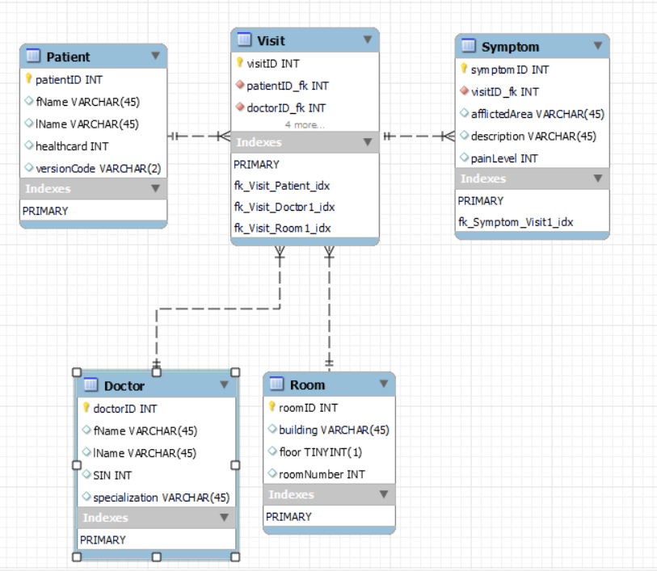

# Hospital Triage Database Design Documentation

## Entities Description

### Patients:
Stores the individual patients in the triage system.

### Visits:
Instances of a patient visiting our facility, whether by appointment or walk-in.

### Symptoms:
Conditions reported which made a visit necessary. Recorded separately for each visit.

### Doctors:
A list of medical personnel who can see patients.

### Rooms:
A list of rooms to which patients can be assigned when a doctor is ready to see them.

## Attributes Specification

### Patients Attributes:
- patientID: Automatically incremented surrogate key.
- fName: First name.
- lName: Last name.
- healthCard: Integer healthcard number, if present.
- versionCode: Two letters at end of health card.
- dob: Patient's date of birth. Included to differentiate patients who lack health cards.
- currentAddress: Patient's address. Included to differentiate patients who lack health cards.

### Visits Attributes:
- visitID: Automatically incremented surrogate key.
- patientID_fk: Foreign key specifying which patient is visiting.
- doctorID_fk: Foreign key specifying which doctor is assigned to this patient during this visit.
- roomID_fk: Foreign key specifying which room the patient was sent to for this visit.
- arrivalTime: When the patient showed up and began waiting.
- seenByDoctor: When the patient was assigned a room/doctor.
- dischareTime: When the patient has been fully treated and is ready to leave.

### Symptoms Attributes:
- symptomID: Automatically incremented surrogate key.
- visitID_fk: Foreign key specifying the visit during which the symptom was experienced.
- afflictedArea: The body part in which the symptom was experienced.
- description: Nature of the symptom, such as affected body functions, visible changes to afflicted area, type of sensation etc.
- painLevel: Pain experienced on a scale from 1-10.

### Doctors Attributes:
- doctorID: Automatically incremented surrogate key.
- fName: First name.
- lName: Last name.
- SIN: Social Insurance Number.
- specialization: The subfield of medicine for which the doctor has the necessary knowledge, skills and abilities.

### Rooms Attributes:
- roomID: Automatically incremented surrogate key.
- building: A string describing the building in which the room is located.
- floor: a 1-byte integer representing the floor on which the room is.
- roomNumber: The room number within the current building - rooms in other buildings may have the same number, hence the need for either surrogate or composite key. Surrogate was easier to reference in other tables.

## Database ERD (Entity-Relationship Diagram)

## Website Overview
This website will allow a patient to check in to the hospital and to input their symptoms and the location they feel pain into the hospital databse. A hospial worker will be able to look at the various patient's symptoms and will be able to decide who to treat first. 

## Design System

### Colour Palette
  -   **Text Colour:** '#ffffff' - The main text of on the website 
  -   **Backgroudnd Colour:** '#981d31' - Used for the colour of the main background 
  -   **Secondary Background Colour:** #555555' - Used for the colour of the any secondary backgrounds
  -   **Border Colour:** '#ffffff' - Border colour of tables and buttons
  -   **Header Colour:** '#6f70ff' - Colour of the headers and titles
    
### Typography
- **Header Text:** '"Times New Roman", Times, serif'
- **Subheadings Text:** '"Times New Roman", Times, serif'
- **Body Text:** '"Times New Roman", Times, serif'

## Hospital Triage App Mock-Ups

## Patient Instructions
Patients will have to enter a piece of identification and then choose where their symptom is, the nature of the symptom and how bad the pain is for each symptom.

## Hospital Staff Instructions
Hospital Staff will go into the staff side of the webside and will see a list of patients that need help. The hospital staff will have to choose a patient that needs help and then go help them. When the patient has been seen, the staff member will have to log discharge time in the database.

